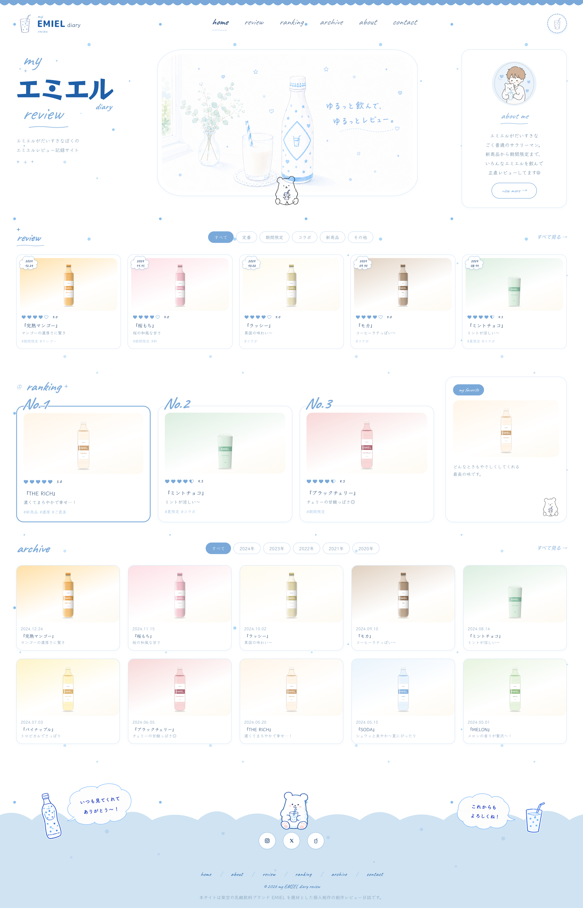
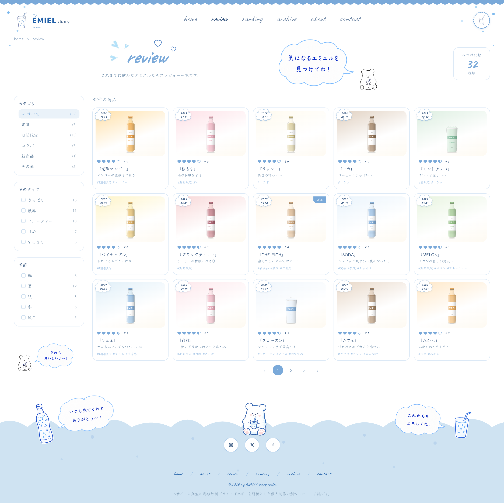
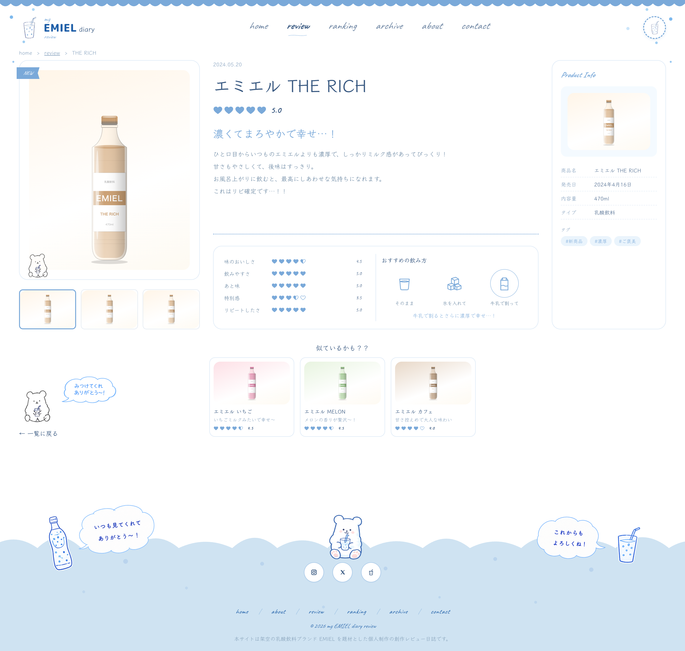
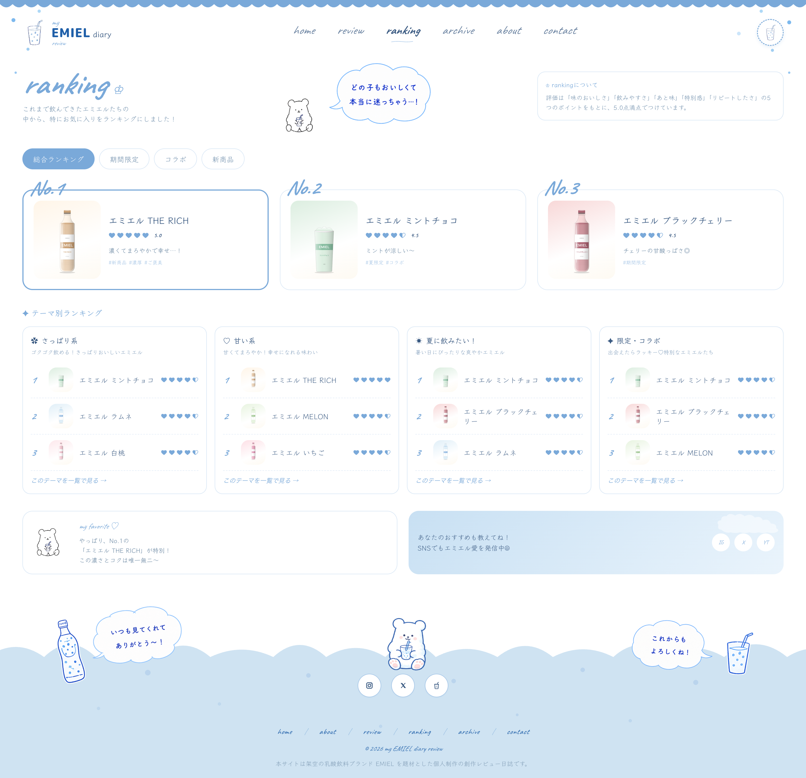
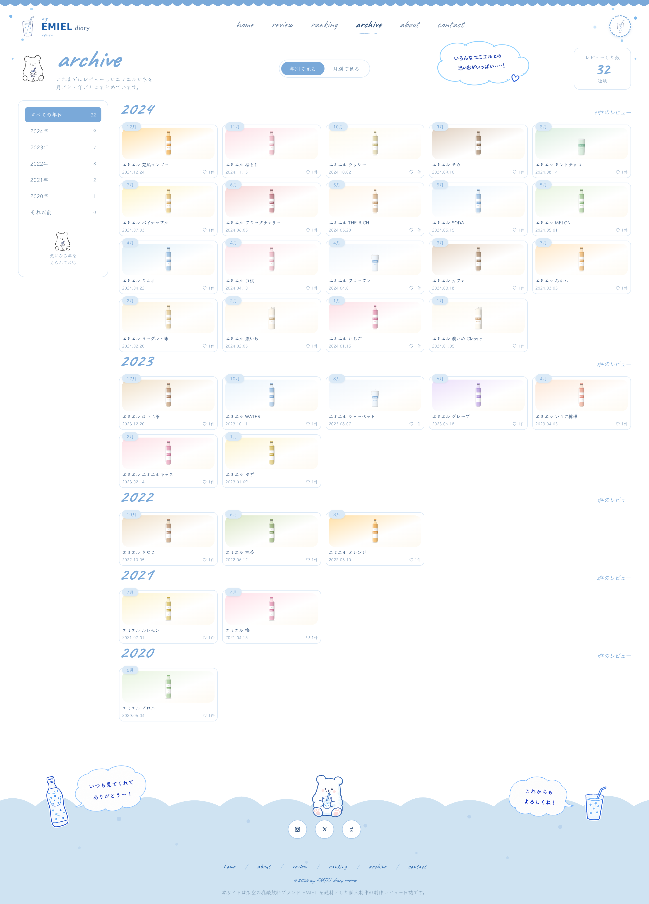
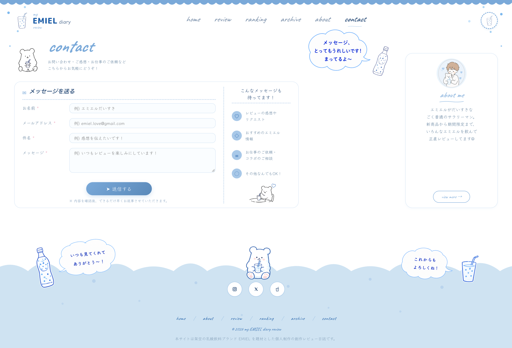

# my EMIEL diary review

[](https://review-emiel.rm0428mr.workers.dev/)


🌐 **Live**: <https://review-emiel.rm0428mr.workers.dev/>

**EMIEL** は架空の乳酸飲料ブランド。 

デザイン力とフロントエンド実装力を伸ばすことを目的に、個人で企画から実装まで一貫して取り組むレビュー日誌サイトを制作しました。題材は、自分自身が大好きな某青と白の乳酸菌系飲料へのリスペクトを込めつつ、著作権・商標に触れないよう
「エミエル」という完全に架空の飲料に置き換え、ファン視点の日記帳としてゼロから世界観を構築。水色（#7aa9d9）と白〜紙色
（#f0eee9）を基調に、手書きフォントとしろくまマスコット・吹き出し・雲・ハート・四点星などの装飾を組み合わせ、かわいさ
と懐かしさのある日誌トンマナに仕上げました。

## コンセプト

- **EMIEL という架空ブランド** の世界観を「個人の日誌」という切り口で表現する
- 商品ラインナップ・キャラクター・ビジュアル・レビュー本文は **すべてオリジナルのフィクション**
- マスコットの **しろくま**（`bear-doodle`）がガイド役
- 紙ノートの質感をデジタルで再現：
  - オフホワイト紙色 `#f0eee9` / 淡い青 `#7aa9d9`
  - `Klee One`（本文）/ `Caveat`（英字あしらい）/ `Yusei Magic`（補助）の 3 書体
  - 雲・吹き出し・ハート・四点星・など手書き装飾

## ステータス

| Phase | 内容 | 状態 |
|---|---|---|
| 0 | ディレクトリ整備 | ✅ |
| 1a | デザインモック確定（claude-design 採用） | ✅ |
| 1b | Pencil で 11 画面学習再現 | ✅ |
| 2 | 設計書（共通 5 本 + 画面別 9 × 2 本） | 🔄 |
| 3 | Astro + React + microCMS 実装（`./site`） | 🔄 |
| 4 | Cloudflare Pages デプロイ | ⏳ |

## 技術スタック

- **Astro 5** + **React 18+**（フィルタ／フォームのみアイランド化）
- **microCMS**（Headless CMS）
- **CSS Modules + CSS 変数**（Tailwind は採用せず、手書き感の SVG / dashed と相性のため）
- **Pagefind**（全文検索、Phase 4 で後乗せ）
- **Cloudflare Pages**（デプロイ + Pages Function でフォーム）
- **Cloudflare Turnstile**（Spam 対策）+ **Discord Webhook**（フォーム通知）
- **Cloudflare Web Analytics**（プライバシー配慮型）

詳細：[`FE/デザイン/共通/05_技術スタック.md`](FE/デザイン/共通/05_技術スタック.md)

## デザイン

[claude-design](claude-design/)（Claude Code Design 出力）をデザインの出発点とし、現在の画面は [`site/`](site/) の実装を参照してください。

以下の6画面は、現在の実装をローカルで表示して作成した画面モックです（2026-10-08 更新、デスクトップ幅 1440px）。商品は架空ブランド **EMIEL** のイラストとサンプルデータで表示しています。画像をクリックすると全体を確認できます。

| 画面 | URL | 現行画面モック |
|---|---|---|
| Home | `/` | [](claude-design/uploads/01-home.png) |
| Review 一覧 | `/reviews` | [](claude-design/uploads/02-review.png) |
| Review 詳細 | `/reviews/[slug]`（サンプル: `/reviews/rich`） | [](claude-design/uploads/03-review-detail.png) |
| Ranking | `/ranking` | [](claude-design/uploads/04-ranking.png) |
| Archive | `/archive` | [](claude-design/uploads/05-archive.png) |
| Contact | `/contact` | [](claude-design/uploads/06-contact.png) |
| About / 404 / 検索結果 | – | モックなし、設計書で起こす |

## ディレクトリ

```
Review-EMIEL/
├── README.md                ← このファイル
├── CLAUDE.md                ← Claude Code 向けプロジェクト指針
├── CONTRIBUTING.md          ← コミット規約・ブランチ運用
├── ADR/                     ← Architecture Decision Records
├── docs/
│   └── devlog/              ← 開発週報
├── FE/デザイン/             ← 画面設計書（共通 5 本 + 画面別 9 × 2 本）
├── claude-design/           ← 初期デザイン + 現行6画面モック（uploads/01〜06）
├── design/pencil/           ← Pencil 学習用 .epgz（本番非依存）
└── site/                    ← Astro 実装（Phase 3 進行中）
```

## 開発ログ

進捗は [`docs/devlog/`](docs/devlog/) に週次で記録。設計判断は [`ADR/`](ADR/) に Architecture Decision Record として残す。

## 関連ドキュメント

- 設計書 — [`FE/デザイン/`](FE/デザイン/)
- ADR — [`ADR/`](ADR/)
- 開発ログ — [`docs/devlog/`](docs/devlog/)
- 貢献ガイド — [`CONTRIBUTING.md`](CONTRIBUTING.md)

## ライセンス

- **ソースコード**: [MIT License](LICENSE)
- **レビュー本文 / 自作イラスト / ブランド関連クリエイティブ**: © 2026 RM0428MR. All rights reserved.

EMIEL は架空の乳酸飲料ブランドです。本サイトのレビュー本文・キャラクター・ビジュアルはすべてオリジナルのフィクションであり、無断転載・転用を禁じます。コード部分の利用条件は [LICENSE](LICENSE) を参照してください。
